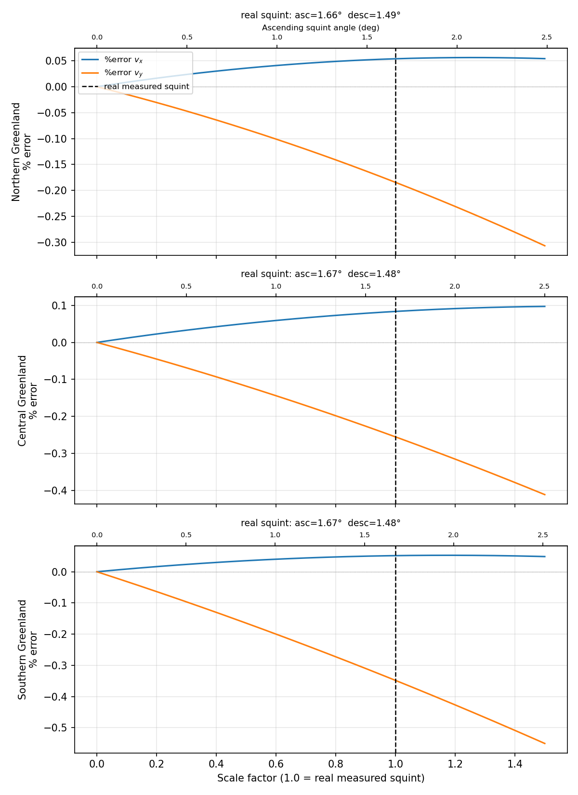
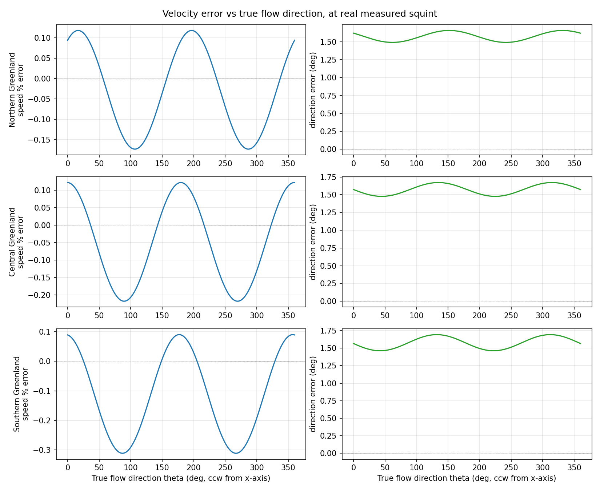

# plotSquintError — Reference

This page is a reference for the question: **does `mosaic3d`'s assumption of zero-Doppler
(broadside) acquisition geometry introduce a material error in computed $(v_x, v_y)$, given
that real NISAR acquisitions carry a small residual squint?** It documents the measurement
methodology, the propagation mechanism, the quantitative findings for both InSAR phase and
speckle-tracked range/azimuth offsets, and the resulting recommendation. It is not a how-to-run
guide — see the bottom of the page for the CLI invocation.

---

## 1. What squint is, and how it's measured here

"Squint" as used here is the angular deviation of the true radar line-of-sight (LOS) from the
idealized, exactly-broadside direction that GrIMP's own geometry code
(`common/llToImageNew.c`, `common/computeHeading.c`) assumes. It is measured **directly from the
official processor's own output**, not modeled or re-derived from orbit state vectors:

$$
\text{squint} = \big(\text{heading}(\hat{\ell}_{\text{LOS}}) - \text{heading}(\hat{\ell}_{\text{along-track}})\big)_{\text{wrapped to }\pm180°} - 90°
$$

where $\hat\ell_{\text{LOS}}$ and $\hat\ell_{\text{along-track}}$ are read directly from each RUNW
product's `science/LSAR/RUNW/metadata/geolocationGrid` cube (`losUnitVectorX/Y`,
`alongTrackUnitVectorX/Y`). These are official NISAR L1 processor outputs (NISAR ATBD, JPL
D-95677 Rev A, §3.4–3.8) — not anything GrIMP computes independently. `measureSquint()` in
`plotSquintError.py` implements exactly this lookup.

This sidesteps an earlier, invalidated approach that modeled squint as a *time shift* in the
azimuth-time assignment (i.e. a nonzero-Doppler Newton solve). That model was wrong: the
zero-Doppler azimuth-time assignment itself is correct and untouched (it is a tautology —
$\vec V_{sat}(\eta_{0,T})\cdot(\vec T-\vec R_{sat}(\eta_{0,T}))=0$ by definition, NISAR ATBD
§3.4.2). Squint instead shows up as a direct **angular** offset of the true LOS from the
idealized broadside direction, at that same (unshifted) time/position — confirmed by the
~91.5°–91.9° (not exactly 90°) angle between `losUnitVector` and `alongTrackUnitVector` in real
products, independently verified via a full 3D ECEF dot product (not a 2D-projection artifact).

### Is squint computable from orbit state vectors alone, without reading the HDF5?

No. The NISAR ATBD (§3.8) splits Doppler centroid into a **geometric** component (computed from
orbit *and attitude* — i.e. it needs the spacecraft attitude quaternion, a separate data product
from orbit state vectors, to define antenna boresight) and a **measured** component (estimated
directly from raw radar data via cross-correlation, then used to bias-correct the attitude
product — "the geometry has already been steered to match the available data," §3.8.2). The true
squint is therefore partly geometric and partly an empirically-calibrated correction layered on
top of it; the two aren't separable from orbit state vectors alone. A from-scratch attempt to
test this (comparing the true 3D ECEF dot product of LOS and satellite velocity, then testing
whether using inertial instead of ECEF velocity closes the gap) closed only about half of a
measured ~1.6° discrepancy, leaving a real, non-derivable residual. The practical conclusion:
squint must be looked up from the product's own `geolocationGrid` (or an attitude/Doppler
product), not computed from state vectors in C.

### Measured values (scene-center, mid-height-level)

| Region | squint (asc) | squint (desc) |
|---|---|---|
| North | 1.658° | 1.494° |
| Central | 1.667° | 1.481° |
| South | 1.674° | 1.482° |

Ascending is consistently **~0.18° higher** than descending across all three regions — systematic,
not noise, plausibly related to look/flight-direction-dependent yaw-steering-law residuals (not
mechanistically confirmed, just measured).

**Within one frame**, squint varies nearly linearly with slant range (~1.5°–1.9° across one
swath; linear-fit residual std only ~0.0085°), and is nearly constant across azimuth (std
~0.009°) and height level (std ~0.013°). **Across sub-frames** of the same track (first vs. last
in a 4-frame sequence), squint drifts only ~0.03° — very stable. Greenland tracks don't exercise
enough heading/latitude range to determine whether squint could become non-monotonic over a much
wider range (e.g. a long Antarctic track spanning many ascending/descending segments near the
pole) — open question, not resolved by this data.

---

## 2. Mechanism: how squint propagates into $(v_x, v_y)$

`mosaic3d`'s crossing-orbit inversion (`common/initRoutines.c`'s `computeA`/`computeVxy`) builds
its solving matrix from the assumed zero-squint headings of the ascending and descending images:

$$
\mathbf{A}_0 = \text{computeA}\big(H_A(0),\,H_D(0)\big)
$$

The true heading is $H_{\text{true}} = H_0 + \text{squint}$ (a direct additive correction, not a
time-shift), giving

$$
\mathbf{A}_{\text{true}} = \text{computeA}\big(H_A(0)+\text{squint}_A,\ H_D(0)+\text{squint}_D\big)
$$

For a true velocity $\vec v_{\text{true}}$, `mosaic3d` actually computes

$$
\vec v_{\text{computed}} = \mathbf{A}_0\,\mathbf{A}_{\text{true}}^{-1}\,\vec v_{\text{true}} = \mathbf{M}\,\vec v_{\text{true}}
$$

This $\mathbf{M}$ is the error-propagation matrix used throughout this analysis.

---

## Figure 1 — error vs. squint magnitude (pure-axis reference cases)



Each region's panel sweeps a **scale factor** applied to that region's own real,
independently-measured $(\text{squint}_A, \text{squint}_D)$ pair (scale=1.0 reproduces the real
measured values exactly, preserving the real asc/desc asymmetry — not an assumed shared squint
for both images). Two reference cases are reported, each avoiding the
direction-dependence/division-by-zero issue of defining a single "%error" for an arbitrary true
velocity direction:

$$
\%\text{error}_{v_x} = (M_{00}-1)\times100 \quad (\vec v_{\text{true}}=\hat x), \qquad
\%\text{error}_{v_y} = (M_{11}-1)\times100 \quad (\vec v_{\text{true}}=\hat y)
$$

**Result at the real measured squint (scale=1.0):**

| Region | %error vx | %error vy |
|---|---|---|
| North | +0.05% | −0.18% |
| Central | +0.08% | −0.26% |
| South | +0.05% | −0.36% |

All sub-percent. $v_y$ is consistently more sensitive than $v_x$ at these crossing geometries,
consistent with the separate crossing-geometry sensitivity result documented in
`mosaicSource/Documents/mosaic3d.md`'s "Error Analysis: Crossing-Geometry Sensitivity" section.

---

## Figure 2 — error vs. true flow orientation, at the real measured squint



The pure-axis numbers above are only two special cases. The fuller picture sweeps every possible
true-flow orientation $\theta$ (0–360°, $\vec v_{\text{true}}=v(\cos\theta,\sin\theta)$) at the
real measured squint (scale=1.0) and reports two complementary error measures:

- **Speed % error**: $(\lVert\mathbf{M}\hat v(\theta)\rVert - 1)\times100$ — oscillates
  sinusoidally with $\theta$ (period 180°), ranging from about −0.17%/+0.12% (North) to
  −0.31%/+0.09% (South). The pure-axis numbers in Figure 1 are close to, but not exactly, the
  extrema of this curve.
- **Direction error**: the angle between $\mathbf{M}\hat v(\theta)$ and $\hat v(\theta)$ — this
  is the more important finding. It is **nearly constant regardless of $\theta$**, at
  approximately:

| Region | direction error |
|---|---|
| North | 1.49°–1.66° |
| Central | 1.48°–1.67° |
| South | 1.46°–1.69° |

**Why direction error is orientation-independent:** $\mathbf{M}$'s off-diagonal terms
($M_{01}\approx-0.027$, $M_{10}\approx+0.027$ for North) are roughly an order of magnitude larger
than its diagonal deviations from 1 ($M_{00}-1\approx0.0005$, $M_{11}-1\approx-0.0019$) — i.e.
$\mathbf{M}$ is dominated by its antisymmetric part and is therefore close to a pure small-angle
**rotation** matrix. A rotation matrix rotates every input vector by the same fixed angle
regardless of that vector's own direction — which is exactly what's observed. Notably, that
near-constant rotation angle (~1.5°–1.7°) is close to the squint angle itself.

**Net takeaway:** squint's dominant effect on computed velocity is a near-constant ~1.5°–1.7°
rotation bias in flow direction (independent of the true flow direction — a systematic bias, not
noise that averages out), plus a smaller (<0.3%) orientation-dependent speed error. Both are
small in absolute terms.

---

## 3. Findings for range/azimuth offsets (speckle tracking)

**Conclusion: low risk, structurally self-consistent.**

`mosaic3d` converts a measured range/azimuth pixel offset into $(v_x,v_y)$ in a single geometric
step: `common/computeHeading.c`'s cross-track heading feeds directly into `computeA`. No other
geometric model is involved.

The key argument is a tautology, not an approximation: the zero-Doppler condition that defines a
pixel's assigned time, $\vec V_{sat}(\eta_{0,T})\cdot(\vec T-\vec R_{sat}(\eta_{0,T}))=0$, forces
the **true** LOS to be **exactly** perpendicular to the **true** satellite velocity at that
instant, by construction — regardless of whether squint exists elsewhere in the system. Since
range-offset sensitivity to ground motion is governed by the (ground-projected) LOS direction and
azimuth-offset sensitivity is governed by the (ground-projected) velocity direction — both
evaluated at this same instant — these two sensitivity directions are exactly orthogonal in the
data's own native geometry, independent of squint. "Assume range ⊥ azimuth" is therefore not an
approximation that squint breaks for offsets.

The only real residual risk is narrower: whether GrIMP's own `computeHeading.c` (using its own
`geodat`-derived state vectors) reproduces the **same** heading that the true acquisition
geometry implies, closely enough. Figures 1 and 2 above directly bound this risk — they model
exactly this "`computeHeading`'s assumed heading is off by the full measured squint" worst case —
and even that worst-case bound is sub-percent in speed and ~1.5°–1.7° in direction. This is the
analysis that applies to offsets.

---

## 4. Findings for phase (interferometry)

**Conclusion: an additional, independent geometric exposure exists, but it is structurally
guarded and practically negligible for NISAR's flat-earth processing path.**

Unlike offsets, phase goes through **two** geometric stages before reaching the same
`computeHeading`-based inversion:

1. **Baseline-to-range conversion** (`common/computePhiZ.c`, `common/computePhiFlatEarth.c`):
   converts the inter-orbit baseline ($B_n$, $B_p$) into an equivalent range correction using

   $$
   \theta_{\text{flat}} = \text{thetaRReZReH}(\text{Range}, R_e, Re H_{\text{fixed}})
   = \arccos\!\left(\frac{R^2+ReH^2-ReZ^2}{2\,R\,ReH}\right)
   $$

   — a pure spherical law-of-cosines formula on three **scalar distances** (slant range,
   Earth-radius+target-height, Earth-radius+satellite-height; `common/initRoutines.c:918`). No
   heading, no along-track direction, nothing cross-track enters this formula. It implicitly
   assumes the satellite/target/Earth-center triangle is exactly 2D — i.e. the LOS lies exactly
   in the plane perpendicular to the ground track — a hard-coded zero-squint assumption,
   structurally independent of (and in addition to) whatever `computeHeading` does downstream.

2. **Heading-based inversion** (same as offsets): the resulting range-equivalent value feeds into
   the same `computeA`/`computeHeading` machinery, carrying the same (small, bounded) risk
   described in §3.

This means phase has a genuinely separate exposure that offsets don't have. However, two
independent findings limit its practical impact for NISAR:

**(a) The baseline itself is already constructed to have ~zero along-track component.**
`common/svBase.c`'s `svBaseTCN()` computes the full 3D inter-orbit baseline in a TCN
(tangential/cross-track/normal) frame, then `svOffsets()`/`svBnBp()` iteratively **solves for**
the second image's matching time specifically to drive the along-track (tangential) baseline
component to ~0 (`dt = dot(b,T)/C1`, converged to a `1e-11` tolerance, `svBase.c:364-381`). Only
then are the cross-track/normal components rotated by $\theta_{\text{flat}}$ into $B_n$/$B_p$
(`svBnBp()`, `svBase.c:271-280`) — the along-track component (`bTCN[0]`) is dropped from that
rotation, but it has already been driven to near-zero by the solve that produced it, so little
information is actually lost. This structurally guards against `thetaRReZReH`'s missing
along-track term mattering much, by construction rather than by chance.

**(b) For NISAR's flat-earth path specifically, $B_n$/$B_p$ are already a tiny residual, not the
full physical baseline.** The ISCE/NISAR processor has already removed the bulk
topographic/geometric phase upstream (see root `CLAUDE.md`'s "ISCE/NISAR flat-earth baseline
path" and `applyFlatEarth`/`computePhiFlatEarth.c`); the $B_n$/$B_p$ that `mosaic3d` corrects for
in this path is only the small residual orbit-error ramp left over, not the full inter-orbit
separation. Any squint-induced projection error in step 1 above acts on an input that is already
small by construction — a second-order-small effect on top of a structurally-guarded
near-zero quantity. (This argument does **not** extend to legacy/non-NISAR full-physical-baseline
ISCE processing through `computePhiZ.c` without `applyFlatEarth` — there the baseline is the real
physical separation, and this analysis has not quantified that case. Flagged as a known,
unquantified gap, not a current NISAR concern.)

---

## 5. Overall recommendation

**No C-code change is warranted for squint in the current NISAR processing chain.** Both legs
(offsets via `computeHeading`'s tautological self-consistency; phase via the structurally-guarded,
practically-negligible baseline exposure for the flat-earth path) bound out at sub-percent speed
error and a small, near-constant ~1.5°–1.7° direction bias — real and systematic, but small. This
finding should be treated as a documented, bounded limitation rather than a defect requiring a
fix; revisit only if `mosaic3d` is extended to process legacy non-flat-earth ISCE data with a
full physical baseline, or to a track geometry (e.g. polar Antarctic) where squint's
latitude/heading dependence has not been characterized.

---

## Usage

```
plotSquintError [--projectDir DIR] [-o OUTPUT.png] [--outputByDirection OUTPUT2.png] [--show]
```

| Option | Default | Description |
|--------|---------|-------------|
| `--projectDir DIR` | `/Volumes/insar1/ian/NISAR/realNISAR/newGreenlandProject` | Root directory containing the example geodats and source RUNW HDF5 files. |
| `-o, --output PATH` | `squintError.png` | Output path for Figure 1 (scale sweep). |
| `--outputByDirection PATH` | `squintErrorByDirection.png` | Output path for Figure 2 (orientation sweep). |
| `--show` | off | Display interactively in addition to saving. |

## Code

[`nisarerrors/plotSquintError.py`](../nisarerrors/plotSquintError.py) — reuses `computeA`,
`headingAndIncidence`, `latLonToPS3413`, and `REGIONS` from
[`plotVerticalSensitivity.py`](../nisarerrors/plotVerticalSensitivity.py); reads real squint
directly from each region's source RUNW HDF5 `geolocationGrid` cube (`measureSquint()`).
