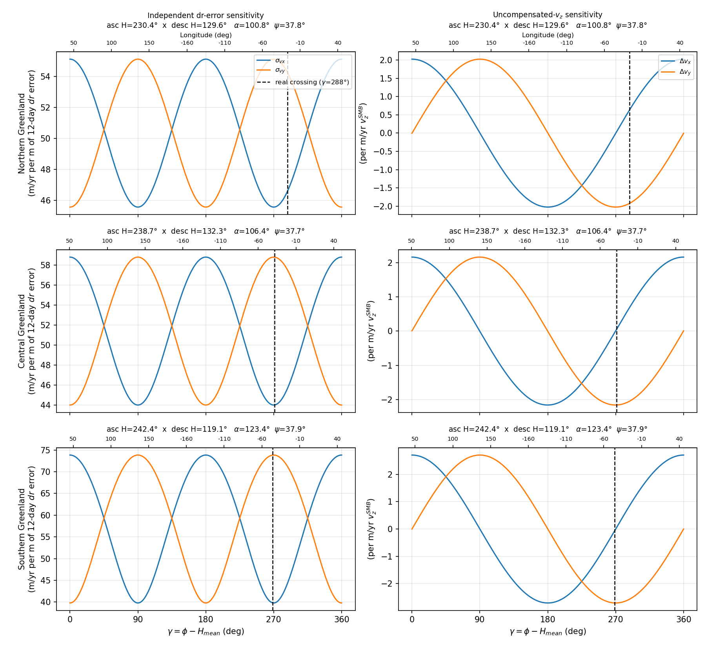

# Error Propagation in Two-Look Crossing-Orbit Velocity Inversion

A surface velocity vector has two horizontal components, but a single SAR pass measures only one
scalar quantity at each point: the line-of-sight (LOS) component of motion. Recovering both
horizontal components requires combining two LOS measurements taken from different viewing
geometries — typically an ascending and a descending pass whose ground tracks cross. This
document derives how two distinct classes of measurement error propagate through that
combination, as a function of the crossing geometry and the pixel's position relative to it.

It is a theory reference, not a usage guide — see the bottom of the page for the CLI invocation
of the companion plotting tool.

---

## 1. Geometric setup

Let $`\hat n_A`$ and $`\hat n_D`$ be the unit vectors, projected onto the ground plane, of the two
LOS directions at a given point (subscripts $A$, $D$ for the two passes — ascending/descending is
the typical case, but the derivation only requires two distinct viewing directions). Each pass
supplies one scalar measurement

$$
p_i = \hat n_i \cdot \vec v, \qquad i \in \{A, D\}
$$

where $`\vec v = (v_x, v_y)`$ is the horizontal velocity and $`p_i`$ is the LOS displacement rate
already scaled to horizontal-velocity units. Writing $`\hat n_A`$ at angle $\beta$ and $`\hat n_D`$
at angle $\alpha+\beta$ (both measured from a common reference direction), the forward model is

$$
\begin{pmatrix} p_A \\ p_D \end{pmatrix} =
\begin{pmatrix}\cos\beta&\sin\beta\\\cos(\alpha+\beta)&\sin(\alpha+\beta)\end{pmatrix}
\begin{pmatrix} v_x \\ v_y \end{pmatrix}
$$

$\alpha$ is the heading difference between the two passes (the *crossing angle*) and $\beta$ is
the pixel's azimuth relative to pass $A$'s heading. Inverting (determinant $\sin\alpha$):

$$
\begin{pmatrix} v_x \\ v_y \end{pmatrix} = \mathbf{A}
\begin{pmatrix} p_A \\ p_D \end{pmatrix}, \qquad
\mathbf{A} = \frac{1}{\sin^2\!\alpha}
\begin{pmatrix}
\cos\beta - \cos\alpha\cos(\alpha+\beta) & \cos(\alpha+\beta) - \cos\alpha\cos\beta \\
\sin\beta - \cos\alpha\sin(\alpha+\beta) & \sin(\alpha+\beta) - \cos\alpha\sin\beta
\end{pmatrix}
$$

This is the flat-terrain form of the inversion; a full treatment adds a slope-dependent
correction term that couples the vertical component of motion along a sloped surface back into
the horizontal solution, but that correction is set aside here so the analysis isolates the pure
crossing-geometry effect.

For the sensitivity analysis below it is more convenient to reference the pixel azimuth $\phi$ to
the *mean* heading $`H_{\text{mean}}=(H_A+H_D)/2`$ rather than to pass $A$ alone:

$$
\gamma = \phi - H_{\text{mean}}
$$

so $\beta = \gamma - \alpha/2$.

$`H_A`$, $`H_D`$ here are each pass's **cross-track** heading at the pixel — the direction of
steepest ground-range change, computed rigorously from the imaging geometry (e.g. by
finite-differencing the geocoding solution across the swath), not assumed. For the geometries
checked here, this coincides with the true instantaneous flight-direction (velocity-vector)
heading rotated by exactly $90°$ to within a few tenths of a degree — so where the true velocity
vector is available, rotating it by $90°$ is an adequate stand-in. The distinction matters when
flight direction is instead approximated from a coarser proxy (e.g. a frame footprint's long-axis
direction, or any other geometric summary that is not the true instantaneous velocity vector),
which is not guaranteed to track the rigorous cross-track heading nearly as closely and should
not be substituted into this formula without checking.

---

## 2. Two regimes of error propagation

How an error in $`p_A,p_D`$ propagates into $`(v_x,v_y)`$ depends qualitatively on whether the error
is the *same* physical quantity contaminating both measurements, or *independent* noise in each.

### 2.1 Common-mode error

A common-mode error is a single physical quantity $\delta$ contributing to both measurements,
generally with different projection factors $`w_A,w_D`$ for the two geometries:
$`\Delta p_A = w_A\delta`$, $`\Delta p_D=w_D\delta`$. The leading physical example is uncompensated
vertical motion $`v_z`$: a vertical rate projects onto each LOS through that pass's own incidence
angle $`\psi_i`$, contributing $`w_i=\cot\psi_i`$ (not simply $1$, which would hold only at
$\psi=45°$).

For **equal** contributions ($`w_A=w_D=1`$, i.e. $\delta$ contaminates both measurements equally),
$\mathbf{A}\cdot(\delta,\delta)^T$ reduces via sum-to-product identities to closed form:

$$
\Delta v_x = \frac{\delta\,\cos\gamma}{\cos(\alpha/2)}, \qquad
\Delta v_y = \frac{\delta\,\sin\gamma}{\cos(\alpha/2)}
\qquad\Longrightarrow\qquad
\frac{\Delta v_y}{\Delta v_x} = \tan\gamma
$$

The split between $`v_x`$ and $`v_y`$ depends **only on $\gamma$** — the pixel's position relative to
the mean heading — and is independent of $\alpha$. The crossing angle $\alpha$ instead sets the
overall *amplitude*, via $1/\cos(\alpha/2)$: this diverges as $\alpha\to180°$ (near-antiparallel
headings, the typical same-platform ascending/descending case) and is modest
($1/\cos45°=\sqrt2$) at $\alpha=90°$ (orthogonal crossing). Near-antiparallel crossing geometry
amplifies a common-mode bias the most, regardless of pixel position; pixel position only
determines which velocity component absorbs more of it.

### 2.2 Independent error

Independent (uncorrelated) noise $`\sigma_{p_A},\sigma_{p_D}`$ in the two measurements separately —
e.g. random measurement noise with no shared physical source — propagates as the diagonal of the
output covariance:

$$
\sigma_{v_x}^2 = A_{00}^2\,\sigma_{p_A}^2 + A_{01}^2\,\sigma_{p_D}^2, \qquad
\sigma_{v_y}^2 = A_{10}^2\,\sigma_{p_A}^2 + A_{11}^2\,\sigma_{p_D}^2
$$

For $`\sigma_{p_A}=\sigma_{p_D}`$, $`\sigma_{v_x}`$ and $`\sigma_{v_y}`$ are the **row norms** of
$\mathbf{A}$ — a fundamentally different combination of $\mathbf{A}$'s entries than the row
*sums* of §2.1, which is why the two error classes have qualitatively different
$\gamma$/$\alpha$ dependence.

The covariance formula above keeps $`\sigma_{p_A}`$ and $`\sigma_{p_D}`$ separate, so it is exact for
any incidence angles $`\psi_A,\psi_D`$. The figure below, however, converts a single raw
per-measurement noise level $`\sigma_{dr}`$ into $`\sigma_p`$ using one mean incidence angle,
$`\psi_{\text{mean}}=(\psi_A+\psi_D)/2`$, applied identically to both looks — exact only when
$`\psi_A=\psi_D`$. For the three example geometries this is a good approximation (both passes use
the same sensor, with $`\psi_A,\psi_D`$ within a few tenths of a degree of each other); a fully
general treatment would instead scale $`\sigma_{p_A}`$ and $`\sigma_{p_D}`$ independently by their
own incidence angles before combining them in the covariance formula.

At $\alpha=90°$ exactly, $\sin\alpha=1,\cos\alpha=0$, and $\mathbf{A}$ collapses to

$$
\mathbf{A}\Big|_{\alpha=90°} = \begin{pmatrix}\cos\beta&-\sin\beta\\\sin\beta&\cos\beta\end{pmatrix}
$$

— an orthonormal **rotation matrix**. A rotation preserves vector length, so
$`\sigma_{v_x}=\sigma_{v_y}`$ at *every* pixel position: perfectly isotropic error propagation,
independent of $\gamma$. Departing from $\alpha=90°$ introduces $\gamma$-dependent anisotropy —
at $\alpha=170°$ (near-antiparallel), the $`\sigma_{v_x}/\sigma_{v_y}`$ ratio ranges from
$\approx0.12$ to $\approx8$ depending on $\gamma$, versus exactly $1$ at every $\gamma$ for
$\alpha=90°$.

### 2.3 Practical implication

Crossing geometry near $\alpha=90°$ is *doubly* favorable: it minimizes amplification of
common-mode bias (amplitude factor $1/\cos45°=\sqrt2$, vs. divergent near $180°$) **and** gives
uniform, isotropic sensitivity to independent noise, regardless of pixel position.
Same-platform ascending/descending pairs ($\alpha$ near $180°$) are the worst case on both
counts, though which velocity component a given common-mode bias falls on is set entirely by
$\gamma$, not by $\alpha$.

---

## Figure



**Figure.** Three rows, one per region (northern, central, southern Greenland — real crossing geometries with
$\alpha=101°$–$123°$, meaningfully closer to the favorable $90°$ case than to the unfavorable
$180°$ case), two columns. Both columns share the same x-axis, $\gamma$ (0°–360°) — the pixel's
azimuth position relative to the mean of the two passes' headings, as defined in §1 — with a
secondary axis showing the corresponding longitude and a dashed marker at each region's actual
crossing-point position (where the two real orbit tracks intersect). Left column: the
independent-error case of §2.2 — sensitivity $`\sigma_{v_x},\sigma_{v_y}`$ (m/yr) to one metre of
equivalent raw, uncorrelated LOS measurement noise in each pass separately, over a 12-day repeat
interval. Right column: the common-mode case of §2.1 — response $`\Delta v_x,\Delta v_y`$ (m/yr)
to 1 m/yr of uncompensated common-mode vertical motion contaminating both passes equally. Both
columns are swept across all $\gamma$ to show the full pixel-position dependence, not just the
value at the real crossing point (marked separately).

At all three regions' real crossing-point positions ($\gamma\approx270°$–$288°$), the common-mode
response is near its extremum in $`v_y`$ and near zero in $`v_x`$ — i.e. uncompensated vertical
motion at these specific geometries biases the along-flow component much more than the
across-flow one.

---

## 3. Application to interferometric phase and cross-correlation offsets

Two distinct measurement techniques commonly supply the LOS displacement rate $`p_i`$ in the
inversion above: interferometric phase, and incoherent cross-correlation (speckle) tracking of
range/azimuth offsets. **The geometric sensitivity derived in §2 applies identically to both** —
the inversion only sees $`p_A,p_D`$ and is indifferent to how they were measured. What differs is
the scaling from the raw measurement to $`p_i`$, and — far more consequentially — the typical
magnitude of the raw measurement noise itself.

**Interferometric phase** measures range change directly and very precisely:
$`p_i \propto \phi_i/\sin\psi_i`$, and the equivalent raw range noise is
$`\sigma_{\delta r} = \frac{\lambda}{4\pi}\sigma_\phi`$. At L-band ($\lambda\approx0.24$ m), even a
generous $`\sigma_\phi\sim0.5`$ rad of unwrapped-phase noise corresponds to only
$`\sigma_{\delta r}\sim1`$ cm of equivalent range noise.

**Cross-correlation offset tracking** measures a pixel-grid displacement whose precision is set
by chip size, correlation strength, and sub-pixel interpolation/oversampling of the correlation
surface — typically dm-to-metre scale, one to two orders of magnitude noisier than phase's
equivalent range precision.

Because the geometric amplification factor (the row norms of $\mathbf{A}$ plotted above) is
identical for both techniques, but their raw noise levels differ by orders of magnitude, the same
crossing-geometry sensitivity translates into a much smaller absolute velocity error for phase
than for offset tracking at the same pixel and geometry. This is the underlying reason
phase-derived estimates are generally weighted more heavily than offset-derived ones in
combined/mosaicked products, wherever phase coherence permits unwrapping — not because the
geometry treats the two differently, but because phase is intrinsically a quieter measurement of
the same physical quantity.

---

## Implementation notes (GrIMP `mosaic3d`)

This derivation matches GrIMP's `mosaic3d` crossing-orbit inversion exactly: `computeA`/
`computeVxy` in `mosaicSource/common/initRoutines.c` (full algorithm description in
`mosaicSource/Documents/mosaic3d.md` §"Full Inversion" and §"Error Analysis: Crossing-Geometry
Sensitivity"), with $\alpha,\beta$ built from `common/computeHeading.c`'s cross-track heading.
Phase's $`p_i`$ scaling and noise model is `computePhiZM3d` (`mosaic3d.md` §"Phase Error"); offset
tracking's is `make3DOffsets.c` (`mosaic3d.md` §"Step 2"). The companion script
`plotVerticalSensitivity.py` evaluates the formulas above using real ascending/descending heading
and incidence-angle values computed from orbital state vectors for three example Greenland
crossing pairs, via a faithful port of `computeHeading.c`'s formula
(`headingAndIncidence()`, using `utilities.geodatrxa.geodatrxa.llzPtToRA()`).

---

## Usage

```
plotVerticalSensitivity [--projectDir DIR] [-o OUTPUT.png] [--show]
```

| Option | Default | Description |
|--------|---------|-------------|
| `--projectDir DIR` | `/Volumes/insar1/ian/NISAR/realNISAR/newGreenlandProject` | Root directory containing the example geodats. |
| `-o, --output PATH` | `verticalSensitivity.png` | Output plot path. |
| `--show` | off | Display interactively in addition to saving. |

The per-region track/frame relative paths (`REGIONS` in the script) are example-specific and not
currently overridable from the command line — edit the script directly for a different project's
example pairs.

## Code

[`nisarerrors/plotVerticalSensitivity.py`](../nisarerrors/plotVerticalSensitivity.py)
